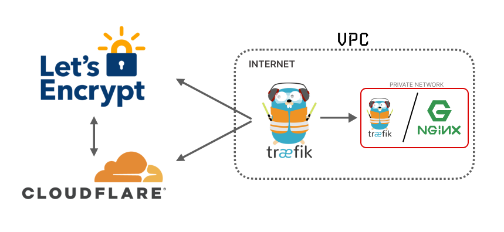

<p align="center">
    
</p>

# Docker Compose Traefik - Proxy Container Service (Cloudflare)

This guide shows you how to deploy your containers behind Traefik reverse-proxy. It will obtain and refresh `HTTPS` certificates automatically and it comes with password-protected Traefik dashboard.

## Run on Local Computer

Docker container:

-   Docker Socket Proxy (security) [Document](https://hub.docker.com/r/tecnativa/docker-socket-proxy/#!)
-   Traefik 2.11.x [Document](https://hub.docker.com/_/traefik)
-   Logger (logrotate & cron) `Custom for Alpine`
-   Whoami (prints OS information - local development) [Document](https://github.com/traefik/whoami)
-   Portainer (Optional) [Document](https://www.portainer.io/)

### Step 1: Make Sure You Have Required Dependencies

-   Git
-   Docker
-   Docker Compose

#### Example Installation on Debian-based Systems:

Official documentation for install Docker with new Docker Compose V2 [doc](https://docs.docker.com/engine/install/), and you can install too Docker Compose V1. Follow official documentation.

```bash
sudo apt-get install git docker-ce docker-ce-cli containerd.io docker-compose-plugin
```

### Step 2: Clone the Repository

```bash
git clone https://github.com/asapdotid/dcc-traefik-https.git
cd dcc-traefik-https
```

Make command help:

```bash
make help
```

### Step 3: Make Initial Environment Variables

```bash
make init
```

Modified file in `.make/.env` for build image

```ini
# Project variables
DOCKER_REGISTRY=docker.io
DOCKER_NAMESPACE=asapdotid
DOCKER_PROJECT_NAME=cf-proxy
```

### Step 3: Make Initial Environment Variables

```bash
make set-init
```

Modified file in `src/.env` for build image

The password is `adminpass` and you might want to change it before deploying to production.

### Step 4: Set Your Own Password

Note: when used in docker-compose.yml all dollar signs in the hash need to be doubled for escaping.

> Install `Apache Tools` package to using `htpasswd`
> To create a `user`:`password` pair, the following command can be used:

```bash
echo $(htpasswd -nb user)

# OR

echo $(htpasswd -nb user password)
```

Running script:

```bash
echo $(htpasswd -nb admin)

New password:
Re-type new password:

admin:$apr1$W3jHMbEG$TCzyOICAWv/6kkraCHKYC0
```

or

```bash
echo $(htpasswd -nb admin adminpass)

admin:$apr1$W3jHMbEG$TCzyOICAWv/6kkraCHKYC0
```

The output has the following format: `username`:`password_hash`. The username doesn't have to be `admin`, feel free to change it (in the first line).

Encode password hash with `base64`:

```bash
echo '$apr1$W3jHMbEG$TCzyOICAWv/6kkraCHKYC0' | openssl enc -e -base64
JGFwcjEkVzNqSE1iRUckVEN6eU9JQ0FXdi82a2tyYUNIS1lDMAo=
```

Check decode:

```bash
echo 'JGFwcjEkVzNqSE1iRUckVEN6eU9JQ0FXdi82a2tyYUNIS1lDMAo=' | openssl enc -d -base64
```

You can paste the username into the `TRAEFIK_BASIC_AUTH_USERNAME` environment variable. The other part, `hashedPassword`, should be assigned to `TRAEFIK_BASIC_AUTH_PASSWORD_HASH`. Now you have your own `username`:`password` pair.

### Step 5: Launch Your Deployment

Optional create docker network `secure` & `proxy` for external used with other docker containers:

```bash
docker network create secure
```

and

```bash
docker network create proxy
```

```bash
make set-init

make build
```

Docker composer make commands:

```bash
make up
# or
make down
```

### Step 6: Additional Docker Service

-   Whoami
-   Portainer

Can remove or command.

### Step 7: Test Your Deployment

```bash
curl -I https://{domain_name}/
```

You can also test it in the browser:

https://{domain_name}/

https://monitor.{domain_name}/

# Deploying on a Public Server With Real Domain

Traefik requires you to define "Certificate Resolvers" in the static configuration, which are responsible for retrieving certificates from an ACME server.

Then, each "router" is configured to enable TLS, and is associated to a certificate resolver through the tls.certresolver configuration option.

Read [Traefik Let's Encrypt](https://doc.traefik.io/traefik/https/acme/)

Here is a list of supported providers, on this project:

-   Cloudflare

Let's say you have a domain `example.com` and it's DNS records point to your production server. Just repeat the local deployment steps, but don't forget to update `TRAEFIK_DOMAIN_NAME`, `TRAEFIK_ACME_DNS_CHALLENGE_PROVIDER_EMAIL` & `TRAEFIK_ACME_DNS_CHALLENGE_PROVIDER_TOKEN` environment variables. In case of `example.com`, your `.src/.env` file should have the following lines:

```ini
TRAEFIK_DOMAIN_NAME=example.com
TRAEFIK_ACME_DNS_CHALLENGE_PROVIDER_EMAIL=email@mail.com
TRAEFIK_ACME_DNS_CHALLENGE_PROVIDER_TOKEN=coudflare-access-token-123ABC
```

Setting correct email is important because it allows Let’s Encrypt to contact you in case there are any present and future issues with your certificates.

## Redirect `WWW` to `NON WWW`

Example labels redirect www to npn www:

```yaml
labels:
    - traefik.enable=true
    - traefik.http.routers.whoami.entrypoints=https
    - traefik.http.routers.whoami.rule=Host(`jogjascript.com`)||Host(`www.jogjascript.com`)
    # Add redirect middlewares for http and https
    - traefik.http.routers.whoami.middlewares=redirect-http-www@file,redirect-https-www@file
```

Example docker compose `whoami`:

```yaml
whoami:
    image: traefik/whoami:latest
    container_name: whoami
    networks:
        - secure
        - proxy
    depends_on:
        - traefik
    labels:
        - traefik.enable=true
        - traefik.http.routers.whoami.entrypoints=https
        - traefik.http.routers.whoami.rule=Host(`jogjascript.com`)||Host(`www.jogjascript.com`)
        # Add redirect middlewares for http and https
        - traefik.http.routers.whoami.middlewares=redirect-http-www@file,redirect-https-www@file
```

## Optinonal add `Portainer` service

Uncomment on docker compose file for `Portainer` service:

File: `.docker/compose/docker-compose.local.yml`

```yaml
portainer:
    image: portainer/portainer-ce:latest
    restart: unless-stopped
    security_opt:
        - no-new-privileges:true
    networks:
        - secure
        - proxy
    volumes:
        - /etc/localtime:/etc/localtime:ro
        - ../../.data/portainer:/data
    labels:
        - traefik.enable=true
        - traefil.docker.network=proxy
        - traefik.http.routers.portainer.entrypoints=https
        - traefik.http.routers.portainer.rule=Host(`portainer.${TRAEFIK_DOMAIN_NAME}`)
        - traefik.http.services.portainer.loadbalancer.server.port=9000
    depends_on:
        - dockersocket
        - traefik
```

## Internal Docker Compose Service Integrate with Traefik (`Labels`)

Sample:

```yaml
labels:
    - traefik.enable=true
    - traefil.docker.network=proxy
    - traefik.http.routers.portainer.entrypoints=https
    - traefik.http.routers.portainer.rule=Host(`app.${TRAEFIK_DOMAIN_NAME}`)
```

Path prefix with loadbalancer:

```yaml
labels:
    - traefik.enable=true
    - traefik.docker.network=proxy
    - traefik.http.routers.backend-v1.entrypoints=https
    - traefik.http.routers.backend-v1.rule=Host(`api.domain_name.com`) && PathPrefix(`/v1`)
    - traefik.http.services.backend-v1.loadbalancer.server.port=3000
    - traefik.http.routers.backend-v1.middlewares=api-strip
    - traefik.http.middlewares.api-strip.stripprefix.prefixes=/v1
```

Sample `nginx` service:

```yaml
nginx:
    image: nginx:stable
    networks:
        - proxy
    depends_on:
        - traefik
    labels:
        - traefik.enable=true
        - traefil.docker.network=proxy
        - traefik.http.routers.portainer.entrypoints=https
        - traefik.http.routers.portainer.rule=Host(`app.${TRAEFIK_DOMAIN_NAME}`)
```

Also included is an option that allows only TLS v1.3. This option must be manually configured. There is an example below on how to do this with a docker label.

```yaml
nginx:
    image: nginx:stable
    networks:
        - proxy
    depends_on:
        - traefik
    labels:
        - traefik.enable=true
        - traefil.docker.network=proxy
        # only TLS v1.3
        - traefik.http.routers.project-app.tls.options=tlsv13only@file
        - traefik.http.routers.portainer.entrypoints=https
        - traefik.http.routers.portainer.rule=Host(`app.${TRAEFIK_DOMAIN_NAME}`)
```

Read instruction after container up [instruction](docs/portainer.md)

## License

MIT / BSD

## Author Information

This Docker Compose Traefik HTTPS was created in 2022 by [Asapdotid](https://github.com/asapdotid) 🚀
