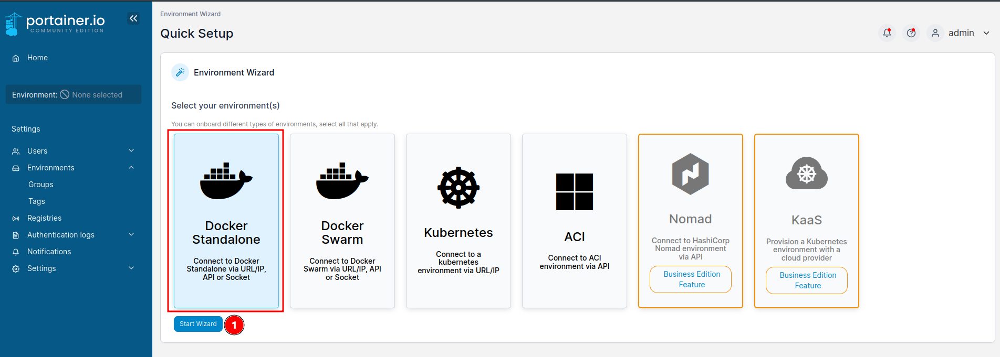
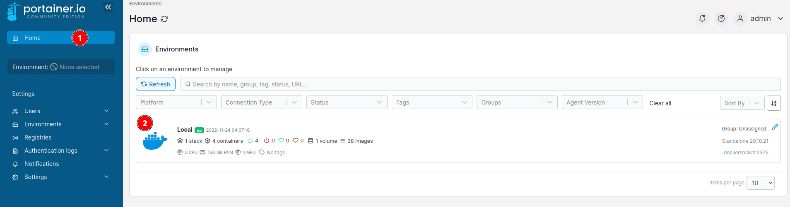
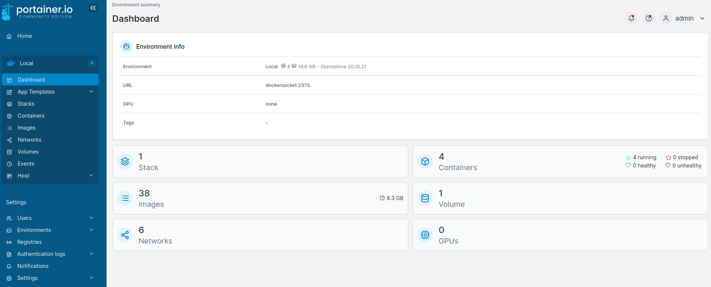

# Portainer + `DOCKER SOKET PROXY`

[Back to home](../README.md)

Setup Portainer Environment using `Docker Socket Proxy`

## 1. Setup Connection to Docker Standalone via URL/IP

    

## 2. Connect to your Docker Standalone environment `(API)`

    

## 3. Connected to Docker URL/IP `(API)`

    

## 4. Environment Info

    

## Author Information

This Docker Compose Traefik was created in 2022 by [Asapdotid](https://github.com/asapdotid) 🚀
